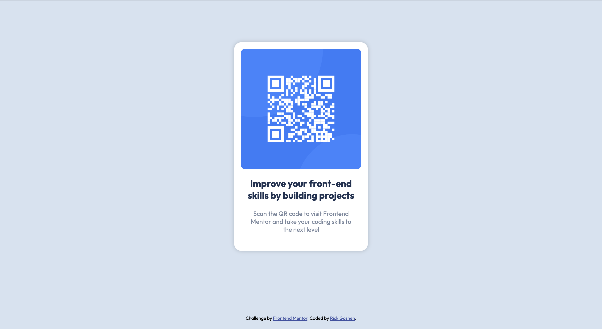

# Frontend Mentor - QR code component solution

This is a solution to the [QR code component challenge on Frontend Mentor](https://www.frontendmentor.io/challenges/qr-code-component-iux_sIO_H). Frontend Mentor challenges help you improve your coding skills by building realistic projects.

## Table of contents

- [Overview](#overview)
  - [Screenshots](#screenshots)
  - [Links](#links)
- [My process](#my-process)
  - [Built with](#built-with)
  - [What I learned](#what-i-learned)
  - [Continued development](#continued-development)
  - [Useful resources](#useful-resources)
- [Author](#author)

**Note: Delete this note and update the table of contents based on what sections you keep.**

## Overview

The challenge was to build out a QR code component and get it to look as close as possible to the images located in design folder and use the this [style guide](./style-guide.md).

### Screenshots

_Desktop 1440px_

_Mobile 375px_

### Links

- Solution URL: [Github repo](https://github.com/rgoshen/qr-code-component-main)
- Live Site URL: [Live site](https://rgoshen.github.io/qr-code-component-main/)

## My process

### Built with

- Semantic HTML5 markup
- CSS custom properties
- Flexbox

### What I learned

I relearned using flexbox without any frameworks. It had been awhile since I really needed to write any CSS without the use of Bootstrap or Material UI. It was fun rediscovering basic CSS for a change.

### Continued development

I just want to keep go back over plain CSS with out the use of frameworks to cement concepts of flexbox, grid and positioning.

### Useful resources

- [MDN Web Docs](https://developer.mozilla.org/en-US/docs/Web/CSS) - This helped me with flexbox concepts and when it is really appropriate to use it.

## Author

- Website - [Rick Goshen](http://rickgoshen.epizy.com/)
- Frontend Mentor - [@rgoshen](https://www.frontendmentor.io/profile/rgoshen)
- LinkedIn - [rickgoshen](https://www.linkedin.com/in/rickgoshen/)
